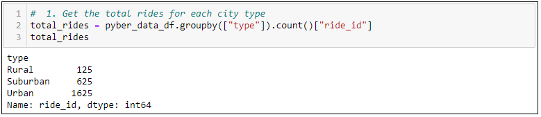
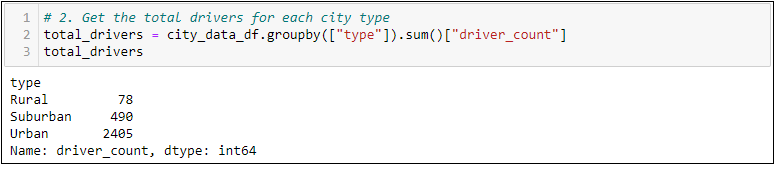
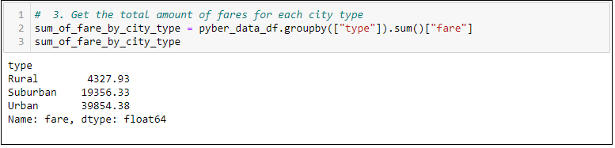
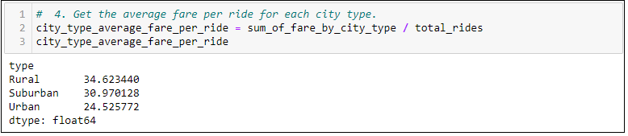
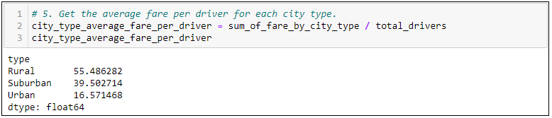

# PyBer Analysis

## Project Overview 
I recenlty joined as a Data Analyst at ***PyBer***, a ride-sharing app company valued at $2.3 billion.

The CEO of PyBer is ***V. Isualize***, who is a former programmer who started out at MathWorks, a co-founder of PyBer, and is known for being extremely fair yet extremely demanding. Because of her programming expertise, she's particularly insistent that the analytical work be comprehensive and correct.

I rceive assignment diretly from her, and I seek help from my manager Omar. 

My first assigment was to perfom some exploratory analysis on data in some very large CSV files. 

I used Python scripts using Panda's libraries, the jupyter notebook, and Matplotlib.

## Purpose of this Analysis

As a part of my first assignment at PyBer, I created various charts for ***V. Isualize***
1) A Bubble chart for the **Average Fare ($)** vs. the **Total Number of Rides** for all 3 city types
2) Box-and-Whisker Plot for **Ride Count** and **Ride Fare** Data for the year 2019 for all 3 city types
3) Pie chart for the **Percentagae of Fares** by all 3 city types
4) Pie chart for the **Percentagae of Rides** by all 3 city types
5) Pie chart for the **Percentagae of Drivers** by all 3 city types

I now have a new assignment from V. Isualize. I have to create a summary DataFrame of the ride-sharing data by city type. Then, using Pandas and Matplotlib, I have to create a multiple-line graph that shows the total weekly fares for each city type. Finally, I have to submit a written report that summarizes how the data differs by city type and how those differences can be used by decision-makers at PyBer.

## Analysis Steps
1.  In Step 1, I used the groupby() function to create a Series of data that had the name of the city as the index, then applied the count() method to the "ride_id" column.
    `total_rides = pyber_data_df.groupby(["type"]).count()["ride_id"]`

2. In Step 2, I used the groupby() function to create a Series of data that had the name of the city as the index, then applied the sum() method to the "driver_count" column.
    `total_drivers = city_data_df.groupby(["type"]).sum()["driver_count"]`

3. In Step 3, I used the groupby() function to create a Series of data that had the name of the city as the index, then applied the sum() method to the "fare" column.  
    `sum_of_fare_by_city_type = pyber_data_df.groupby(["type"]).sum()["fare"]`

4. In Step 4, I calculated the average fare per ride by city type by dividing the sum of all the fares by the total rides.
    `city_type_average_fare_per_ride = sum_of_fare_by_city_type / total_rides`

5. In Step 5, I calculated the average fare per driver by city type by dividing the sum of all the fares by the total drivers.
    `city_type_average_fare_per_driver = sum_of_fare_by_city_type / total_drivers`

6. In Step 6, I created a PyBer summary DataFrame with all the data gathered from Steps 1-5, using the column names shown in the module challenge.
    ```
    pyber_summary_df = pd.DataFrame({
    "Total Rides":total_rides,
    "Total Drivers":total_drivers,
    "Total Fares":sum_of_fare_by_city_type,
    "Average Fare Per Ride":city_type_average_fare_per_ride,
    "Average Fare Per Driver": city_type_average_fare_per_driver})
    ```
7.  In Step 7, I used the provided code snippet to remove the index name ("type") from the PyBer summary DataFrame. 
    `pyber_summary_df.index.name = None`

8. In Step 8, I formatted the columns of the Pyber summary DataFrame to look the oens given in the challenge.
    ```
    pyber_summary_df["Total Rides"] = pyber_summary_df["Total Rides"].map("{:,}".format)
    pyber_summary_df["Total Drivers"] = pyber_summary_df["Total Drivers"].map("{:,}".format)
    pyber_summary_df["Total Fares"] = pyber_summary_df["Total Fares"].map("${:,.2f}".format)
    pyber_summary_df["Average Fare Per Ride"] = pyber_summary_df["Average Fare Per Ride"].map("${:,.2f}".format)
    pyber_summary_df["Average Fare Per Driver"] = pyber_summary_df["Average Fare Per Driver"].map("${:,.2f}".format)
    ```

9. In Step 9, I created a new DataFrame with multiple indices using the groupby() function on the "type" and "date" columns of the pyber_data_df DataFrame, then applied the sum() method on the "fare" column to show the total fare amount for each date.
`total_fare_per_day_per_city = pd.DataFrame(pyber_data_df.groupby(["type", "date"]).sum()["fare"])`

10. In Step 10, I used the provided code snippet to reset the index. This was needed to use the pivot() function in Step 11.
`total_fare_per_day_per_city = total_fare_per_day_per_city.reset_index()`

11. In Step 11, I used the pivot() function to convert the DataFrame from Step 10 so that the index is the "date," each column is a city "type," and the values are the "fare."
`total_fare_pivot = total_fare_per_day_per_city.pivot(index='date',columns='type', values='fare')  `

12. In Step 12, I created a new DataFrame by using the loc method on the following date range: 2019-01-01 through 2019-04-29.
`total_fare_between_2019_01_01_and_2019_04_29 = total_fare_pivot.loc['2019-01-01':'2019-04-29']`

13. In Step 13, I used the provided code snippet to reset the index of the DataFrame from Step 12 to a datetime data type. This was necessary to use the resample() method in Step 15.
`total_fare_between_2019_01_01_and_2019_04_29.index = pd.to_datetime(total_fare_between_2019_01_01_and_2019_04_29.index)`

14. In Step 14, I used the provided code snippet, df.info(), to check that the "date" is a datetime data type.
`total_fare_between_2019_01_01_and_2019_04_29.info()`

15. In Step 15, I created a new DataFrame by applying the resample() function to the DataFrame I modified in Step 13. I resampled the data in weekly bins, then applied the sum() method to get the total fares for each week.
`sum_of_fare_by_weeks = total_fare_between_2019_01_01_and_2019_04_29.resample("W").sum()`

16. Finally, in Step 16, I graphed the resampled DataFrame from Step 15 using the object-oriented interface method and the df.plot() method, as well as the Matplotlib "fivethirtyeight" graph style code snippet provided in the starter code. I annotated the y-axis label and the title, then use the appropriate code to save the figure as PyBer_fare_summary.png in my "analysis" folder.
```
# Import the style from Matplotlib.
from matplotlib import style
# Use the graph style fivethirtyeight.
style.use('fivethirtyeight')

#Plotting sum_of_fare_by_weeks per city type uisng the Object-Oriented approach
ax = sum_of_fare_by_weeks.plot(figsize=(20,10))

#Set axis 
ax.set_title("Total Fare by City Type", fontsize = "20")
ax.set_xlabel("Date", fontsize = "16")
ax.set_ylabel("Fare($USD)", fontsize = "16")
ax.grid(True)

ax.legend(["Rural","Suburban", "Urban", ], title="type", loc="center", fontsize="15", mode="Expanded")

plt.savefig("analysis/PyBer_fare_summary.png")
plt.show()
```
17. Since my chart was not mathcing the one provided in the module challenge, I experimented with the dates and found with my chart will match the chart in the module if I choose the date range as 2019/01/01 - 2019/04/28 (ending 1 day earlier). My codee for that graph is 
```
total_fare_between_2019_01_01_and_2019_04_28 = total_fare_pivot.loc['2019-01-01':'2019-04-28']
total_fare_between_2019_01_01_and_2019_04_28.index = pd.to_datetime(total_fare_between_2019_01_01_and_2019_04_28.index)
sum_of_fare_by_weeks = total_fare_between_2019_01_01_and_2019_04_28.resample("W").sum()

# Use the graph style fivethirtyeight.
style.use('fivethirtyeight')
#Plotting each category
ax = sum_of_fare_by_weeks.plot(figsize=(20,10))
#Set axis 
ax.set_title("Total Fare by City Type", fontsize = "20")
ax.set_xlabel("Date", fontsize = "16")
ax.set_ylabel("Fare($USD)", fontsize = "16")
ax.grid(True)
ax.legend(["Rural","Suburban", "Urban", ], title="type", loc="center", fontsize="15", mode="Expanded")
plt.savefig("analysis/PyBer_fare_summary_till_20190428.png")
plt.show()
```
## Analysis Results

Below were some of the outcomes of the analysis

1. Total number of rides for each type of city - Urban Cities had by far the most number of rides. The total number of rides for Urban cities was 1,626, which was 2.6 times the rides in suburban cities, and 13 timees the number in rural cities.

    **Image 1 (below) : Total number of rides for each city type**


2. Total number of drivers for each city type - completing the comparitively large number rides in Urban cities were 2,405 drivers, this is 4.9 times the number in suburban cities and 30.8 times the number in rural cities.

    **Image 2 (below) : Total number of drivers for each city type**


3. Total amount of fare for each city type - The total amount of fare collected in Urban cities was $39,854, which was almost 2.1 times the amount collected in Suburban cities, and 9.2 times of the total fare collected in rural cities.

    **Image 3 (below) : Total number of fare collected for each city type**


4. Average fare per ride for each city type - Urban cities, at $24.53, has the lowest average fare per ride, which was 0.79 times of the average fare in Suburban cities, and 0.70 times the average fare per ride in Rural cities.

    **Image 4 (below) : Average fare per ride for each city type**


5. Average fare per driver for each city type - Urban cities, at $16.57, has the lowest average fare per driver, which was 0.42 times of the average fare in Suburban cities, and 0.30 times the average fare per driver in Rural cities.

    **Image 5 (below) : Average fare per driver for each city type**


6. The line chart - total Fare by city Type from Jan 1, 2019 to End of April, 2019


## Summary
Summary: Based on the results, provide three business recommendations to the CEO for addressing any disparities among the city types.

There is a statement summarizing three business recommendations to the CEO for addressing any disparities among the city types. (4 pt)


1.

2.

3.


================================================================